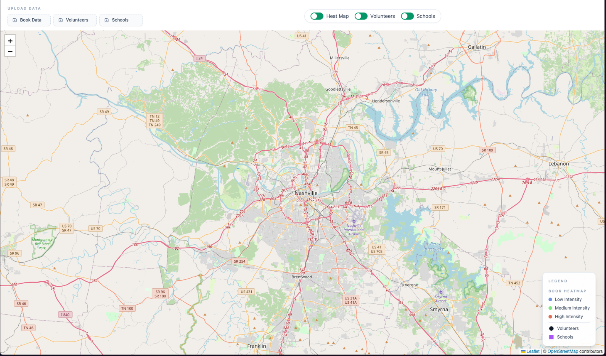

# Nashville Book Distribution Map

An interactive web map for visualizing book distribution activity across the Nashville area. The app supports three layers: a book distribution heatmap, volunteer markers, and school markers.

## Run Locally

```bash
npm install
npm run dev
```

Then open: http://localhost:3000

## How to Use

- Upload data using the buttons in the top-left:
  - Book Data
  - Volunteers
  - Schools
- Toggle layers on/off from the controls at the top:
  - Heat Map
  - Volunteers
  - Schools
- Click markers to view details (counts by ZIP or location).



## Data Upload Format

You can upload either:

- One Excel workbook (.xlsx) containing three sheets named exactly:
  - Book Recipients
  - RIF Volunteers
  - RIF Schools
- OR up to three CSV files, one per dataset (filenames like `Book Recipients.csv`, `RIF Volunteers.csv`, `RIF Schools.csv` recommended).


Expected columns:

- Book Recipients: `zipcode`, `# of books received`
- Volunteers: `zipcode`, `# of volunteers`
- Schools: `zipcode`, `# of schools` (or one row per school depending on export)
